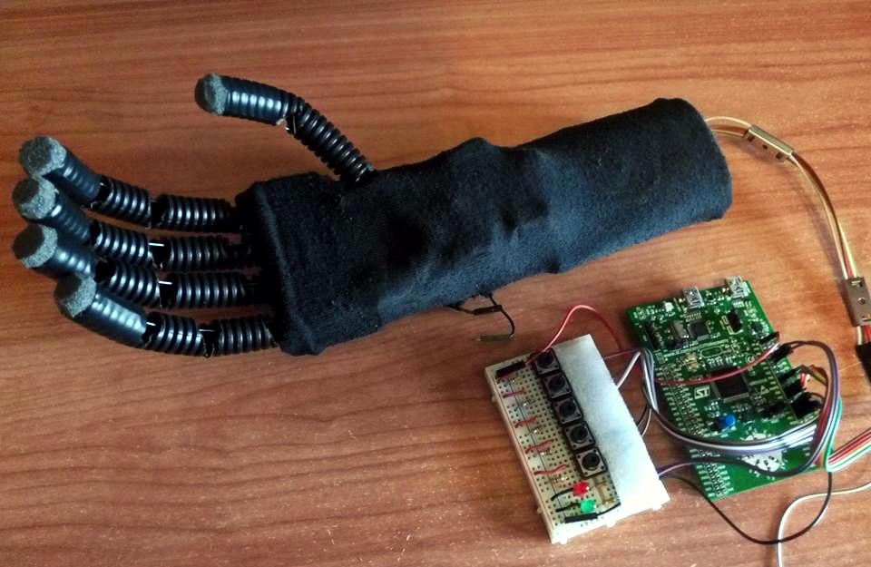

# robotic-hand
*A simple library to control a robotic hand prototype by using an external controller.*

**Notes:**
 The project runs on *ST STM32F3 Discovery ARMv7 32-bit Cortex-M4* through *ChibiOS/RT*.
 The servos are powered by a series of four AA 1,5V battery to obtain 6V while the microcontroller needs 5V.

**Future improvements:**
- Using flex sensors attached to a glove's fingers to control the hand.
- Mechanical improvements.
